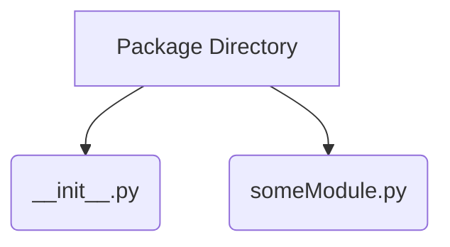

# Popular Packages

- numpy
- pandas
- matplotlib

# Import

`import numpy as np` import package and assign a nickname

`from numpy.linalg import linalg as lin` import subpackage and assign a nickname

# Custom Packages

Package Structure

`somePackageName` package folder

`_ _init_ _.py` initializes package

Some Attributes

`__dict__`

`__name__`

`__file__`

`__version__`

`__author__`

`__doc__`

`__main__`

